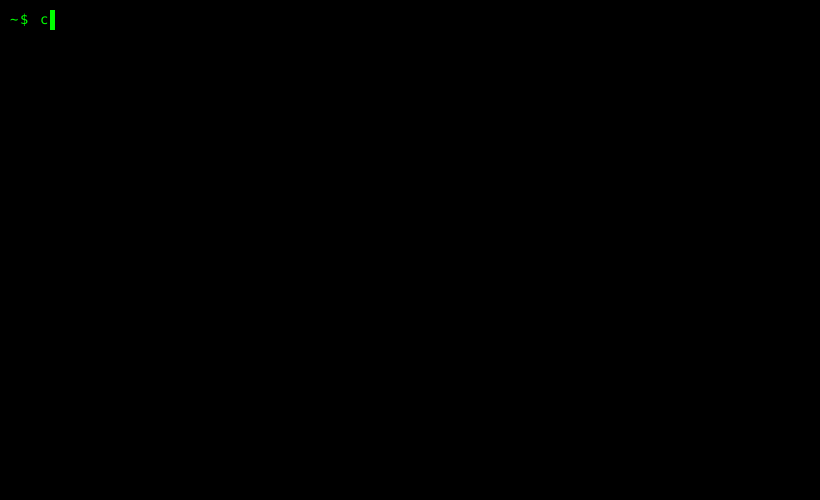

# cargo-slicer

**cargo-slicer** slices Rust crate dependencies down to only the code actually used by a project.

## Usage

```bash
# Build the release binary
cargo build --release
```



```bash
# Slice all dependencies of the current project
target/release/cargo-slicer --no-bench --clean
```


```bash
# Essential options
target/release/cargo-slicer --help
```


## Architecture

The slicer uses a **copy-and-delete** approach that guarantees LOC reduction:

```
Copy Source → Parse AST → Build Graph → Mark Used → Delete Unused → Cleanup
     ↓            ↓            ↓            ↓            ↓            ↓
  Original    syn::File   Dependencies    BFS      Remove Items   Format
```

**Five Phases:**
1. **Identify Sliceable Crates**: Find dependencies that can be sliced
2. **Measure LOC**: Count original lines of code per crate
3. **Collect Usage**: Scan project for used items from each crate
4. **Code Generation**: Copy source, mark used items via BFS, delete unused
5. **Cycle Breaking**: Detect and break circular path dependencies

```
src/
├── main.rs          # Entry point, CLI parsing
├── types.rs         # Core data structures (ParsedItem, CrateIndex, etc.)
├── constants.rs     # Static configuration (RUST_KEYWORDS, FFI_CRATES)
├── slice_all.rs     # Multi-crate batch slicing orchestration
├── watch.rs         # Watch mode: monitor files and auto-rebuild
├── cycle_detector.rs # Tarjan's SCC for cycle detection
├── cycle_breaker.rs  # Break circular dependencies
│
├── common/          # Shared utilities
│   ├── cfg_eval.rs  # Cfg expression parsing and evaluation
│   ├── arch.rs      # Architecture detection and filtering
│   ├── ast_parser.rs # AST parsing utilities
│   └── item_visitor.rs # Item traversal
│
├── slicer/          # Copy-and-delete slicer (default)
│   ├── cache.rs     # Incremental caching for sliced outputs
│   ├── copy.rs      # Copy source, fix Cargo.toml
│   ├── marker.rs    # BFS marking of used items
│   ├── deleter.rs   # Remove unused items from AST
│   ├── cleanup.rs   # Clean empty modules
│   ├── dependency_graph.rs # Build item dependency graph
│   └── features.rs  # Feature configuration (-O, -f flags)
│
└── old_slicer/      # Legacy generation-based slicer
    └── ...          # (deprecated, kept for reference)
````

## Optimization System (Compiler-Style Flags)

The slicer supports graduated optimization levels like GCC:

### Optimization Levels (-O)

| Level | Description | Features Enabled |
|-------|-------------|------------------|
| `-O0` | Conservative (default) | No deletion, safe baseline |
| `-O1` | Private function deletion | Highest impact/risk ratio |
| `-O2` | All private item deletion | +constants, +types, +trial-delete, +trial-sets |
| `-O3` | +Graph-guided deletion | +graph-guided (fast JSON-based verification) |
| `-O4` | Full aggressive mode | Trust dependency graph completely |

### Feature Flags (-f)

Enable/disable individual features:

```
# Deletion features
-fprivate-fn       # Delete unused private functions
-fprivate-const    # Delete unused private constants/statics
-fprivate-type     # Delete unused private type aliases
-fprivate-struct   # Delete unused private structs/enums
-ftrust-graph      # Trust graph for all items (risky)

# Trial deletion modes (Phase 5b)
-ftrial-delete     # Enable trial-based deletion
-ftrial-sets       # Use dependency-aware removal sets
-fgraph-guided     # Graph-guided + JSON verification (fastest)

# Analysis features
-fcycle-breaking   # Enable cycle detection & breaking
-fcfg-eval         # Evaluate #[cfg(...)] for target platform
-farch-filter      # Filter architecture-specific code
-fauto-fixes       # Apply Cargo.toml compatibility fixes

# Verification
-fverify           # Run cargo check after deletion
-fprofiling        # Detailed timing analysis per phase

# Override blocked crates
-fslice-<crate>    # Force slice a normally-blocked crate
```

## Self-Slicing Results

`cargo-slicer` slices its own 251 dependencies:

```
---------- ---------- ---------- -------- --------   ----------------------------------------
    765629     639132      16.5%       OK        -   TOTAL (179 crates in unknown_sliced/)
   2251269     639132      71.6%                     ORIGINAL (251 crates in dependency tree)

Compilation Summary:
  Success: 153/153 (100.0%)
  Failed:  0/153
  Not Tested: 26
  Total Errors: 0
```

- **251 dependency crates** in the full tree, **179 sliceable** (excludes FFI, proc-macro, platform-specific)
- **71.6% overall LOC reduction** (2.25M to 639K lines)
- **100% compilation success** on all 153 tested crates
- Self-hosted build produces a working binary
