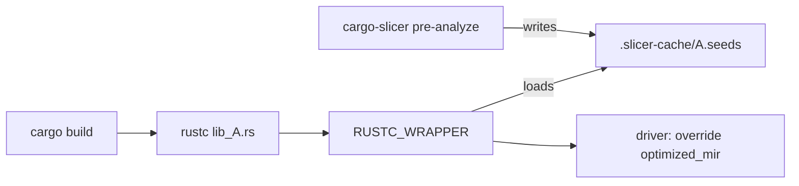
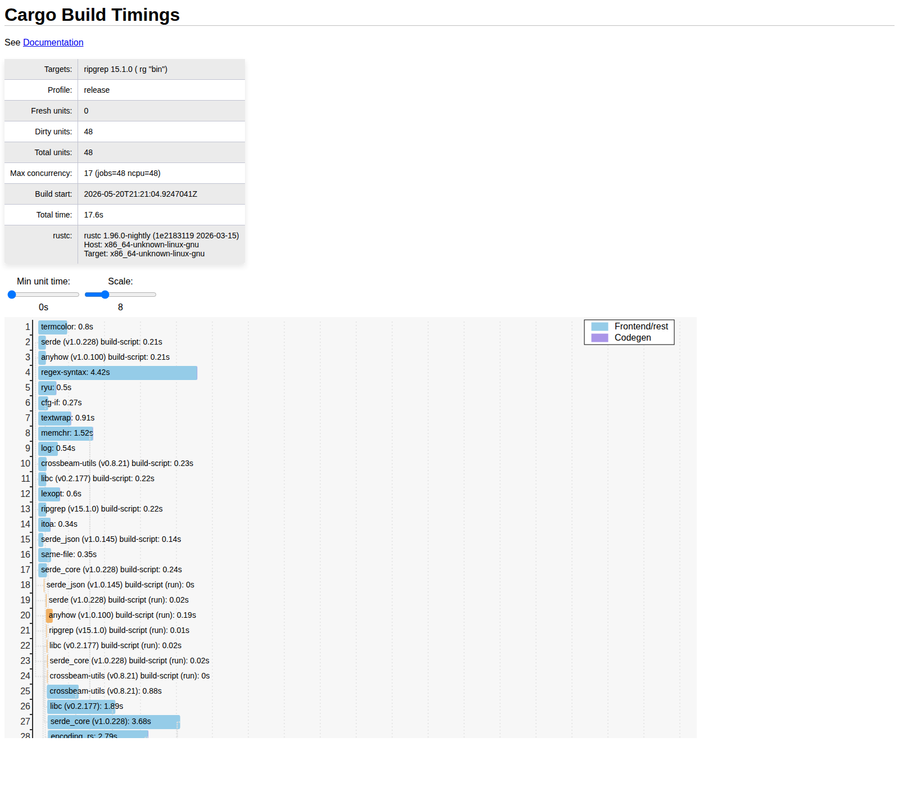
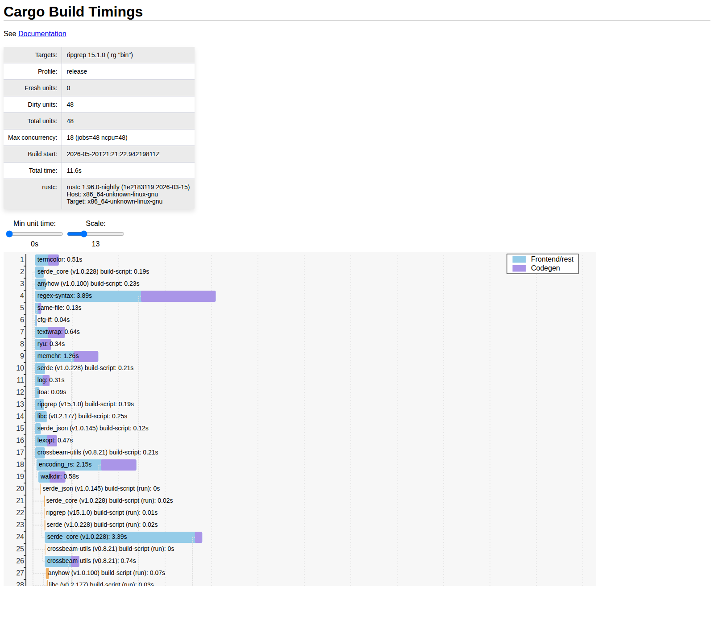

# What we learned wiring cargo-slicer toward an in-tree MCP

*Draft, 2026-05-21. Audience: rustc compiler developers and Rust users who
care about build times.*

Earlier this month Oli Scherer (rustc-mono / MIR review) read our design
sketch for an in-tree cross-crate dead-function elimination MCP and asked
three things back:

1. Is the syn-based pre-analysis cost actually included in the speedup
   you're claiming?
2. How does syn synchronize with rustc?
3. Could `cargo build --timings` visualize the design?

Each question needed a real measurement. This post is what we found.

## Background — what we're trying to do

cargo-slicer is a `RUSTC_WRAPPER` that stubs unreachable function bodies
at MIR level. The intuition: when you compile `ripgrep`, every library it
depends on (libc, encoding_rs, regex-syntax, …) carries far more code
than the binary uses. The compiler emits LLVM IR for all of it; the
linker discards most. We can short-circuit that pipeline by replacing
unreachable bodies with `loop { panic!() }` before LLVM ever sees them.

The "unreachable" decision needs a cross-crate call graph. Today
we build that with a pre-pass (`cargo-slicer pre-analyze`) that uses
[`syn`](https://docs.rs/syn) to parse every workspace crate's source,
then BFS from the binary's `main`. The pre-pass writes per-crate
`.seeds` files; our custom rustc driver reads them and stubs the rest.

rustc nightly already has a `-Z dead-fn-elimination` pass that handles
the binary-only case (intra-crate reachability from `entry_fn`). The MCP
proposal extends that existing pass with a `-Z dead-fn-elimination-oracle=PATH`
flag: cargo writes the path, the pass reads the file and applies the
same body-stubbing to library compiles. The userspace pre-analysis
stays as-is; only the per-rustc-invocation driver fork goes away.

## Question 1 — Are we hiding the syn cost?

The easiest to answer once we looked. The bench harness
(`bench_fresh_build.sh:286–303`) snapshots `START` before pre-analyze
and `END` after `cargo build` finishes. The syn cost is fully inside
the window.

We then measured pre-analyze **in isolation**, no overlapping build:

| project | syn pre-analyze (s) | build wall (s) | overhead |
|---|---|---|---|
| ripgrep (17 crates) | 0.25 | 8 | 3.1% |
| helix (16 crates) | 0.60 | 47 | 1.3% |

Even pessimistically priced, syn is 1–3% of the build wall.

In practice it's invisible. cargo spends ~0.5–2 s on `cargo metadata`
work before the first rustc invocation. We launch pre-analyze in
parallel with `cargo build`; on every project we've measured, syn
finishes before cargo has even started compiling anything.

The implication: the speedup numbers we publish already include
pre-analyze time. The in-tree proposal preserves the property — cargo
writes the oracle path, rustc reads it, the pre-pass keeps running in
the same overlap window.

## Question 2 — How does syn synchronize with rustc?

It doesn't, and that's the design.

No shared memory, no IPC, no locks. The synchronization is the
filesystem.

The key safety property: if rustc reaches lib_A before pre-analyze has
written `.seeds`, the driver falls through to "compile normally, no
stubs" (`virtual_slicer.rs:178–195`). The build stays correct, it just
doesn't get the speedup. This is also what happens in the in-tree
proposal when `-Z dead-fn-elimination-oracle` points at a missing file:
the pass emits a lint and skips.

We also gate on a source hash. Each `.seeds` file carries a
`SOURCE_HASH:` header computed from the workspace's source tree. If the
hash doesn't match at consume time, the driver invalidates and falls
through. We've never seen this fire in practice — pre-analyze is fast
enough that staleness doesn't accumulate — but the gate is there.

Dead-function elimination is a performance optimization, not a
correctness pass. A missing or stale oracle costs speed, not soundness.
The synchronization model leans entirely on that property.

## Question 3 — Can `cargo build --timings` visualize this?

Yes, and it turns out to be the most informative measurement of the
three.

`cargo build --timings` emits an HTML chart with one bar per crate
showing its compile window. We captured the HTML for baseline vs
`vslice-cc` on ripgrep, then parsed the per-unit JSON inside the HTML
to compute deltas.

*Baseline: 17.6s total. Each bar is one crate; the codegen segment
(darker right portion) dominates registry deps.*

*vslice-cc: 11.6s total. Same 48 units, same dependency graph — the
codegen segments shrink because stubbed bodies don't reach LLVM.*

**ripgrep, single run** (artifacts under `docs/assets/oli-mcp-timings/`):

|  | wall | crit-path | units |
|---|---|---|---|
| baseline | 17.7 s | 17.6 s | 48 |
| vslice-cc | 11.7 s | 11.6 s | 48 |
| speedup | 1.52× | 1.52× | — |

Same 48 cargo units in both modes. Each unit's `rustc` just takes less
time.

**Where the time went, top 10:**

| Crate | Baseline | vslice-cc | Saved |
|---|---|---|---|
| libc | 1.89 s | 1.11 s | +0.78 |
| encoding_rs | 2.79 s | 2.15 s | +0.64 |
| regex-syntax | 4.42 s | 3.89 s | +0.53 |
| grep-matcher | 0.59 s | 0.23 s | +0.36 |
| serde_core | 3.68 s | 3.39 s | +0.29 |

The big savings are in **registry deps with broad public APIs that
ripgrep uses narrowly**. ripgrep imports a small slice of libc; the
BFS prunes the rest. encoding_rs ships every encoding table; ripgrep
needs three.

But the same view also showed something we didn't expect:

**Bottom 5 — crates that *regress* under vslice-cc:**

| Crate | Baseline | vslice-cc | Δ |
|---|---|---|---|
| globset | 0.92 s | 1.98 s | -1.06 |
| ignore | 1.63 s | 2.51 s | -0.88 |
| grep-regex | 0.63 s | 1.28 s | -0.65 |
| grep-printer | 1.04 s | 1.53 s | -0.49 |
| grep-cli | 0.68 s | 1.02 s | -0.34 |

These are ripgrep's own workspace crates. Small public APIs, almost
entirely reachable from the binary, so vslice-cc stubs nothing — but
they still pay the cost of being routed through our custom driver.

That cost is the dispatch fork (cargo → `cargo_slicer_dispatch` →
`cargo_slicer_rustc` → real rustc). We measured it independently with
an M3 microbench: ~17 ms per invocation just for the chain to set up.

**This is the argument for the in-tree MCP.** Today, every crate
ripgrep builds pays the cost of being routed through our userspace
driver chain (cargo → dispatch → driver → real rustc), even when
stubbing gains it nothing. The five regressing crates above cost a
combined 3.4 s of extra wall time. With the in-tree extension, rustc
reads the oracle directly — no userspace fork, no per-invocation
startup chain.

We have not measured the speedup the in-tree path would deliver — that
needs the rustc patch first. What we have is an M3 microbench
(`scripts/bench_m3_oracle_vs_fork.rs`) that measures the two endpoints
in isolation: parsing a 1500-item `.seeds` file takes 1.65 ms; forking
the dispatch chain and exec'ing rustc takes 18.95 ms. The fork chain
is 11.5× the parse cost. How much of that gap translates into wall-time
savings on real workloads depends on contention, scheduling, and which
crates carry the overhead — we don't claim a number without measuring.

## A finding we weren't expecting

While wiring up the timings work, we re-ran the older "MIR-precise"
variant (vslice-cc-mp), which deserialises extern crates' MIR from
`.rmeta` to refine seeds beyond what syn alone produces. It stubs
more items than syn — and across 36 timings on 4 projects, it builds
**30–47% slower** than syn-based on every one. On ripgrep it matches
baseline; on nushell and zeroclaw it loses to baseline.

The takeaway for the MCP proposal: ship with the syn-level oracle
only. Full writeup — including why the "more items stubbed = faster
build" inference was wrong — in
[oli-mcp-mp-postmortem.md](oli-mcp-mp-postmortem.md).

## Where this leaves the MCP

The three measurements answer Oli's questions and tighten the proposal:

- **Syn cost is real but small** (≤3% of build wall, masked by overlap).
  Ship the pre-pass as-is.
- **Synchronization is file handoff.** No cargo changes needed.
- **Per-crate timings explain the speedup** (registry deps with broad
  APIs shrink the most) and **identify the bottleneck** (workspace
  leaves pay driver-fork overhead with little to gain).
- **MIR-precise is out.** The proposal needs only the syn-level oracle.

The in-tree extension's job is to remove the userspace fork chain so the
workspace-leaf regressions go away. The pre-pass stays where it is.

## What we'd build to convince ourselves further

Three things this exercise didn't measure:

- The proposal itself. The above uses Impl 1 (userspace driver) as a
  proxy. The real numbers need the rustc patch.
- `DefPathHash` overhead in the in-tree pass vs the userspace driver's
  `def_path_str` matching. Expected to be faster, not slower, but
  unmeasured.
- Staleness gate behaviour under `cargo check` / `cargo build`
  interleaving. We've never seen the gate fire in practice; we should
  build a workload that should trigger it and confirm.

These are the work that gets unblocked if the MCP lands.

---

*Code and benches: [cargo-slicer](https://github.com/yijunyu/cargo-slicer).
Design doc: `docs/oli-mcp-design.md`. Perf follow-up:
`docs/oli-mcp-perf-followup.md`. Timings analysis:
`docs/oli-mcp-timings.md`.*
