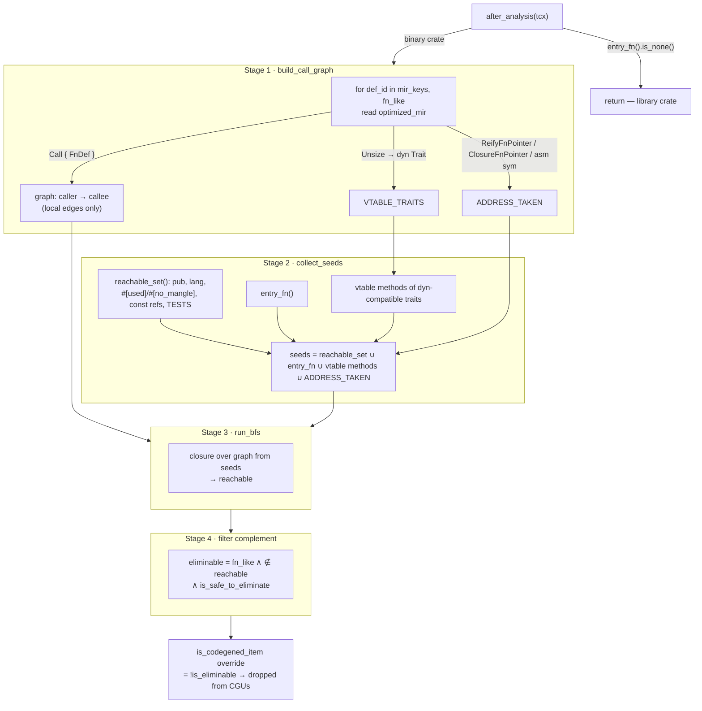
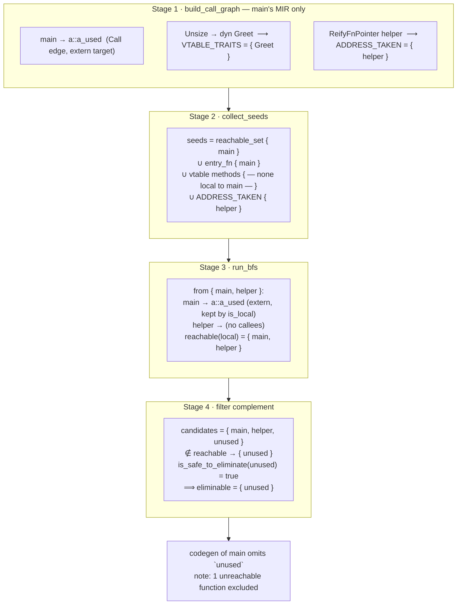

# `dead-fn-elimination`

The tracking issue for this feature is: [#XXXXX]

------------------------

This flag enables a whole-program dead-function elimination pass on **binary
crates**. After analysis, before codegen, the compiler runs a BFS reachability
analysis over the local call graph rooted at the binary's entry points. Functions
that are provably unreachable — and safe to drop — are excluded from their
CodegenUnits, so LLVM never sees them.

```
rustc -Zdead-fn-elimination main.rs
```

It is `UNTRACKED`: it changes codegen output but not the incremental query graph,
so it never invalidates cached queries.

## Why

`-C opt-level` lets LLVM strip unreachable functions, but only *after* it has
already been handed every function's IR. The codegen and LLVM-optimization cost of
functions that are never called is paid before they are deleted. This pass moves
the reachability decision *before* codegen: an unreachable function is never
lowered to LLVM IR at all. On binary crates with large dependency surfaces this
removes a measurable fraction of total codegen work.

It is **scoped to binary crates only**. Library crate types (`rlib`, `dylib`,
`cdylib`, `staticlib`, `proc-macro`) early-return: their public items are reachable
by definition (a downstream crate may call any `pub fn`), so without an entry point
the analysis has no valid roots.

## Dataflow

The pass is a single function, `run_analysis(tcx)`, invoked once from
`after_analysis`. It is a four-stage pipeline: build the call graph, collect the
seed (root) set, run BFS, then filter the complement through a safety checklist.
The output is a set of `DefId`s that the `is_codegened_item` query override reports
as not-codegened.

```
                         ┌────────────────────────────────────────┐
                         │  after_analysis(tcx)                    │
                         │  entry_fn().is_none()? ──► return (lib) │
                         └───────────────────┬────────────────────┘
                                             │ binary crate
                                             ▼
   ┌──────────────────────────────────────────────────────────────────────┐
   │  STAGE 1 — build_call_graph(tcx)                                       │
   │                                                                        │
   │  for def_id in tcx.mir_keys(()) where def_kind.is_fn_like():           │
   │      body = tcx.optimized_mir(def_id)                                  │
   │      ├─ scan terminators:  Call { FnDef(callee) }  ──► edge caller→callee
   │      └─ scan_for_address_taken(body):                                  │
   │             Cast(Unsize → dyn Trait)        ──► VTABLE_TRAITS  (side)  │
   │             Cast(ReifyFnPointer)            ──► ADDRESS_TAKEN  (side)  │
   │             Cast(ClosureFnPointer)          ──► ADDRESS_TAKEN  (side)  │
   │             InlineAsm { SymFn }             ──► ADDRESS_TAKEN  (side)  │
   │                                                                        │
   │  out: graph : FxIndexMap<DefId, FxIndexSet<DefId>>   (local edges only)│
   └───────────────────────────────┬───────────────────────────────────────┘
                                    │              ┌─────────────────┐
                                    │              │ VTABLE_TRAITS   │
                                    │              │ ADDRESS_TAKEN   │  (thread-local
                                    │              └────────┬────────┘   side tables)
                                    ▼                       │
   ┌────────────────────────────────────────────────┐      │
   │  STAGE 2 — collect_seeds(tcx)                   │      │
   │                                                 │      │
   │  reachable_set(())   ──► all already-reachable  │◄─────┘ (vtable methods of
   │                          items (pub, lang,      │         dyn-compatible traits)
   │                          #[used]/#[no_mangle],  │
   │                          const refs, TESTS …)   │
   │  + entry_fn()        ──► fn main / harness      │
   │  + vtable methods    ──► from VTABLE_TRAITS     │
   │  ───────────────────────────────────────────   │
   │  seeds ∪= ADDRESS_TAKEN  (indirectly-called)    │
   │                                                 │
   │  out: seeds : FxHashSet<DefId>                  │
   └───────────────────────────────┬─────────────────┘
                                    ▼
   ┌────────────────────────────────────────────────┐
   │  STAGE 3 — run_bfs(seeds, &graph)               │
   │                                                 │
   │  marked = seeds (sorted for determinism)        │
   │  while queue: pop u; for v in graph[u]:         │
   │      if marked.insert(v): queue.push(v)         │
   │                                                 │
   │  out: reachable : FxHashSet<DefId>              │
   └───────────────────────────────┬─────────────────┘
                                    ▼
   ┌────────────────────────────────────────────────────────────────┐
   │  STAGE 4 — eliminable = { f ∈ mir_keys : fn_like(f)             │
   │                           ∧ f ∉ reachable                       │
   │                           ∧ is_safe_to_eliminate(tcx, f) }      │
   │                                                                 │
   │  out: ELIMINABLE_DEF_IDS : FxHashSet<idx>                       │
   └───────────────────────────────┬─────────────────────────────────┘
                                    ▼
   ┌────────────────────────────────────────────────────────────────┐
   │  override_queries: is_codegened_item(def_id)                    │
   │      = !is_eliminable(def_id.index)   ──► dropped from CGUs     │
   └────────────────────────────────────────────────────────────────┘
```

The same pipeline as a flowchart (rendered by mdbook's mermaid preprocessor):



### The side tables

The straight call-graph BFS only follows direct `Call` terminators. Three kinds of
*indirect* reachability are invisible to it, so they are collected during the same
MIR walk (Stage 1) and folded into the seed set (Stage 2) rather than into the
graph itself:

| Side table | Captures | Folds into seeds as |
|------------|----------|---------------------|
| `VTABLE_TRAITS` | `dyn Trait` constructions (`Unsize` coercion) | every impl method of the trait, when `dyn`-compatible |
| `ADDRESS_TAKEN` | `fn`-pointer reification, closure→fn-ptr coercion, inline-asm `sym fn` | the function whose address was taken |

A function reached only through a vtable or a function pointer therefore enters BFS
as a root, not via an edge — it survives even though no direct call site names it.

### The safety checklist

A function in the *complement* of the reachable set is eliminated only if
`is_safe_to_eliminate` returns `true`. Each guard removes a class of functions that
are unreachable by the call graph but must still be codegened:

| Guard | Reason it cannot be dropped |
|-------|----------------------------|
| not `is_local()` | extern-crate items are codegened by their own crate |
| `def_kind` ∉ {`Fn`, `AssocFn`} | only free fns and inherent/impl methods are candidates |
| vtable-trait impl method | reachable via dynamic dispatch (mirror of `VTABLE_TRAITS` seeding) |
| `#[no_mangle]` / `#[used]` / `export_name` / explicit `linkage` | linker-visible symbol |
| `Drop::drop` impl | drop glue is inserted by the compiler outside the call graph |
| the entry `fn` | the program root |
| `generics_of().requires_monomorphization()` | generic; reachability is a post-mono property |
| `asyncness().is_async()` | the coroutine state-machine transform runs after this point |

`#[test]`/`#[bench]` need no explicit guard: by `after_analysis` they have already
been lowered into the harness's `TESTS` slice, which `reachable_set` covers, so they
are seeded as reachable in Stage 2.

## Worked example

Consider a binary `main` that depends on two library crates `a` and `b`:

```rust
// crate b  (rlib)
pub fn b_used()    { println!("b"); }   // called by a::a_used
pub fn b_dead()    {}                   // never called anywhere
fn   b_private()   {}                   // never called

pub trait Greet { fn hello(&self); }    // used as `dyn Greet` in main
pub struct En;
impl Greet for En { fn hello(&self) { b_used(); } }
```

```rust
// crate a  (rlib)
pub fn a_used() { b::b_used(); }        // called by main
pub fn a_dead() {}                      // never called
fn   a_local() {}                       // never called
```

```rust
// crate main  (bin)
fn helper() {}                          // address taken below, never called directly
fn unused() {}                          // never referenced at all

fn main() {
    a::a_used();                        // direct call
    let g: &dyn b::Greet = &b::En;      // vtable construction
    g.hello();                          // dynamic dispatch
    let f: fn() = helper;               // fn-pointer reification
    f();
}
```

Build with `cargo +nightly rustc -Zdead-fn-elimination` (or wrap every `rustc`
invocation, e.g. via `RUSTFLAGS`). Each crate is compiled separately, so the pass
runs three times — but only one run does anything:

| Crate | `entry_fn()` | Pass behaviour |
|-------|--------------|----------------|
| `b` (rlib) | `None` | **early-return** — no roots, every `pub fn` is reachable by definition. `b_dead`, `b_private`, `En::hello` all kept. |
| `a` (rlib) | `None` | **early-return** — same. `a_dead`, `a_local` kept. |
| `main` (bin) | `Some(main)` | full analysis (traced below). |

This is the central design point: **dead code in `a` and `b` is not removed when
`a` and `b` are compiled.** A library cannot know whether a downstream crate calls
`b_dead`, so it must codegen it. Cross-crate dead code is reached only by giving
those leaf crates their own entry points (a binary, an integration test, a bench).

### Tracing the `main` crate

Only `main`'s own `mir_keys` are candidates — `{ main, helper, unused }`. The
extern functions `a::a_used`, `b::b_used`, `b::En::hello` belong to crates `a`/`b`
and are rejected by the `is_local()` guard regardless.



Result for the `main` crate:

| Function | Reachable? | Eliminated? | Why |
|----------|-----------|-------------|-----|
| `main` | yes (entry) | no | the entry function |
| `helper` | yes | no | address taken → seeded via `ADDRESS_TAKEN`; survives even though never *called* directly |
| `unused` | no | **yes** | unreachable and passes every safety guard |

`helper` is the instructive case: a plain call-graph BFS would drop it (nothing
calls it), but the `let f: fn() = helper` coercion records it in `ADDRESS_TAKEN`,
so Stage 2 seeds it and it survives. `unused` has no such escape hatch and is the
only function excluded from codegen.

If you later turn `b` into a binary (add a `main` that calls only `b_used`), the
pass *would* run on `b` and eliminate `b_dead` and `b_private` there — illustrating
why the per-crate entry point, not cross-crate graph walking, is what unlocks
elimination of a library's dead code.

## Correctness invariant

In debug builds the pass asserts `reachable_set(()) ⊆ post-BFS reachable`. Because
every member of `reachable_set` is folded into the seeds (Stage 2), BFS can only
*grow* the set, never drop one — so nothing the rest of the compiler considers
reachable can ever be eliminated. The assertion catches any future regression in
the seeding logic.

## Diagnostics

`-Zdead-fn-elimination` emits a single note per binary crate:

```
note: N unreachable functions excluded from codegen by -Z dead-fn-elimination
```

## Limitations

- **Binary crates only.** Eliminating exports from `cdylib`/`staticlib` would
  require a user-supplied exported-symbols list and is left to future work.
- **Local edges only.** The call graph does not walk extern-crate MIR; cross-crate
  reachability is handled entirely through `reachable_set` seeding. (An earlier
  cross-crate graph walk was removed — it could not demote anything, since
  `is_safe_to_eliminate` already rejects non-local `DefId`s.)
- **Whole-function granularity.** All impl methods of a `dyn`-compatible trait are
  kept; per-method vtable pruning would need a post-mono "which vtable slots are
  actually called" query (a `FIXME` shared with `rustc_passes::reachable`).
